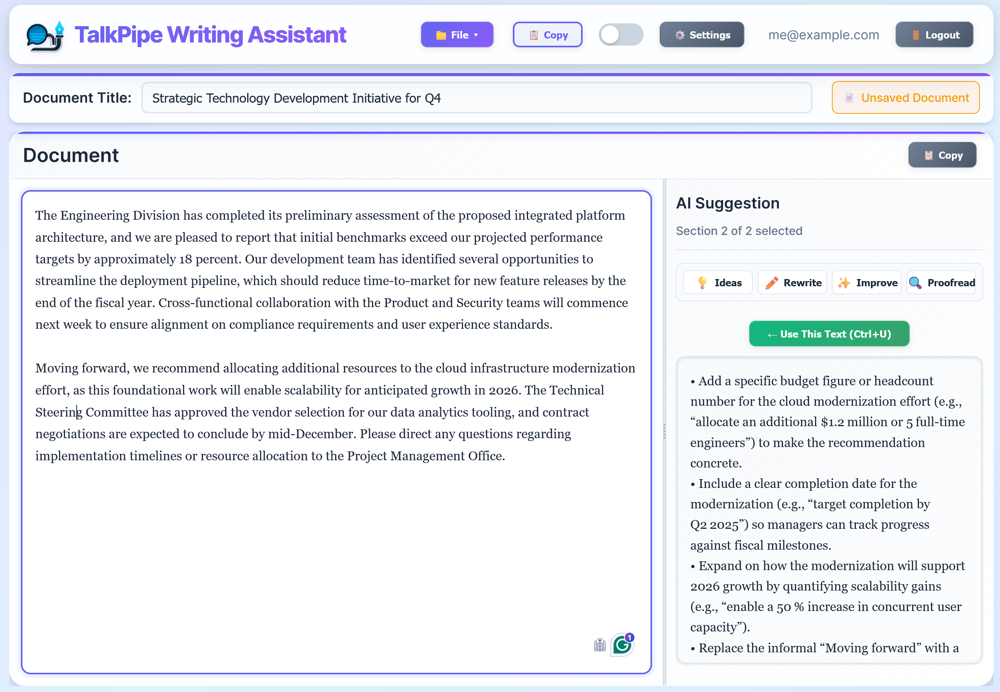

<center></center>

# TalkPipe Writing Assistant

Making the AI write _with_ you, not _for_ you.

An AI-powered writing assistant that transforms how you create structured documents. This application combines intelligent content generation with intuitive document management, enabling writers to craft professional documents with contextually-aware AI assistance that understands your style, audience, and objectives.

Built on the [TalkPipe framework](https://github.com/sandialabs/talkpipe), this tool helps you:

- **Break writer's block**: Generate initial drafts and ideas for any section
- **Maintain consistency**: AI understands your document's context, style, and tone across all sections
- **Iterate quickly**: Multiple generation modes (rewrite, improve, proofread, ideas) let you refine content efficiently
- **Stay organized**: Structure documents into sections with main points and supporting text
- **Work offline**: Use local LLMs via Ollama or cloud-based models via OpenAI, Anthropic, and more

<center></center>

## Features

- **Multi-User Support**: JWT-based authentication with per-user document isolation
- **Structured Document Creation**: Organize your writing into sections with main points and user text
- **AI-Powered Generation**: Generate contextually-aware paragraph content using advanced language models
- **Multiple Generation Modes**:
  - **Rewrite**: Complete rewrite with new ideas and improved clarity
  - **Improve**: Polish existing text while maintaining structure
  - **Proofread**: Fix grammar and spelling errors only
  - **Ideas**: Get specific suggestions for enhancement
- **Real-time Editing**: Dynamic web interface for seamless writing and editing
- **Document Management**: Save, load, and manage multiple documents with automatic snapshots
- **User Preferences**: Per-user AI settings, writing style, and environment variables
- **Customizable Metadata**: Configure writing style, tone, audience, and generation parameters
- **Flexible AI Backend**: Support for OpenAI (GPT-4, GPT-4o), Anthropic (Claude 3.5 Sonnet, Claude 3 Opus), and Ollama (llama3, mistral, etc.)
- **Database Storage**: SQLite database with configurable location for easy backup and deployment
- **Async Processing**: Efficient queuing system for AI generation requests

## Installation

### Prerequisites

- Python 3.11 or higher
- An AI backend: OpenAI, Anthropic, or Ollama (local)

### Install from pip (Recommended)

```bash
pip install talkpipe-writing-assistant
```

After installation, you can start the application immediately:

```bash
writing-assistant
```

Then navigate to `http://localhost:8001` in your browser. See the [Quick Start](#quick-start) section below for next steps.

### Install from source

```bash
git clone https://github.com/sandialabs/talkpipe-writing-assistant.git
cd talkpipe-writing-assistant
pip install -e .
```

### Development Installation

```bash
git clone https://github.com/sandialabs/talkpipe-writing-assistant.git
cd talkpipe-writing-assistant
pip install -e .[dev]
```

### Using Docker

```bash
# Production deployment
docker-compose up talkpipe-writing-assistant

# Development with live reload
docker-compose --profile dev up talkpipe-writing-assistant-dev
```

## Quick Start

**TL;DR:** After `pip install talkpipe-writing-assistant`, just run `writing-assistant` and open `http://localhost:8001` in your browser!

After installing with pip, follow these steps to get started:

### 1. Start the Server

```bash
writing-assistant
```

The server will start on `http://localhost:8001` and display:

```
🔐 Writing Assistant Server - Multi-User Edition
📝 Access your writing assistant at: http://localhost:8001/
🔑 Register a new account at: http://localhost:8001/register
🔐 Login at: http://localhost:8001/login
📚 API documentation: http://localhost:8001/docs
💾 Database: /home/user/.writing_assistant/writing_assistant.db
```

### 2. Create Your Account

1. Open your browser and navigate to `http://localhost:8001/register`
2. Enter your email address and password
3. Click "Register" to create your account

### 3. Configure AI Backend

You need to configure one of the supported AI backends:

**Option A: OpenAI (Cloud)**
1. Get an API key from [OpenAI Platform](https://platform.openai.com/api-keys)
2. Set your API key:
   ```bash
   export OPENAI_API_KEY="sk-your-api-key-here"
   ```
3. In the web interface: Settings → AI Settings → Set Source to `openai` and Model to your model of choice.

**Option B: Anthropic (Cloud)**
1. Get an API key from [Anthropic Console](https://console.anthropic.com/)
2. Set your API key:
   ```bash
   export ANTHROPIC_API_KEY="sk-ant-your-api-key-here"
   ```
3. In the web interface: Settings → AI Settings → Set Source to `anthropic` and Model to your model of choice.

**Option C: Ollama (Local, Free)**
1. Install Ollama from [ollama.com](https://ollama.com)
2. Pull a model: `ollama pull [model name]`
3. Start Ollama: `ollama serve`
4. In the web interface: Settings → AI Settings → Set Source to `ollama` and Model to [model name]

### 4. Start Writing!

1. Click "Create New Document"
2. Add a title and sections, leaving a blank line between sections.
3. Click "Generate" on any section to create AI-assisted content
4. Save your work with the "Save Document" button

That's it! You're ready to use the AI writing assistant.

## Usage

### Starting the Server

```bash
# Default: http://localhost:8001
writing-assistant

# Custom port
writing-assistant --port 8080

# Custom host and port
writing-assistant --host 0.0.0.0 --port 8080

# Enable auto-reload for development
writing-assistant --reload

# Custom database location
writing-assistant --db-path /path/to/database.db

# Disable custom environment variables from UI (security)
writing-assistant --disable-custom-env-vars

# Initialize database without starting server
writing-assistant --init-db

# You can also use environment variables
WRITING_ASSISTANT_PORT=8080 writing-assistant
WRITING_ASSISTANT_RELOAD=true writing-assistant
WRITING_ASSISTANT_DB_PATH=/path/to/database.db writing-assistant
```

When the server starts, it will display:
- The URL to access the application
- Registration and login URLs
- API documentation URL
- Database location

**Authentication:** The application uses JWT-based multi-user authentication with FastAPI Users. Each user has their own account with secure password storage. New users can register through the web interface at `/register`, and existing users log in at `/login`.

### Environment Variables

Configure the application with these environment variables:

| Variable | Description | Default |
|----------|-------------|---------|
| `WRITING_ASSISTANT_HOST` | Server host address | `localhost` |
| `WRITING_ASSISTANT_PORT` | Server port number | `8001` |
| `WRITING_ASSISTANT_RELOAD` | Enable auto-reload (development) | `false` |
| `WRITING_ASSISTANT_DB_PATH` | Database file location | `~/.writing_assistant/writing_assistant.db` |
| `WRITING_ASSISTANT_SECRET` | JWT secret key for authentication | Auto-generated (change in production) |
| `TALKPIPE_OLLAMA_BASE_URL` | Ollama server URL for local models | `http://localhost:11434` |


**Security Options:**
- `--disable-custom-env-vars`: Prevents users from configuring environment variables through the browser interface
  - Use this for shared deployments or when you want centralized credential management
  - Environment variables must be set at the server level (via shell environment)
  - The Environment Variables section will be hidden in the UI


**Configure document metadata**:
   - AI Source: `openai`, `anthropic`, or `ollama`
   - Model: e.g., `gpt-4`, `claude-3-5-sonnet-20241022`, or `llama3.1:8b`
   - Writing style: formal, casual, technical, etc.
   - Target audience: general public, experts, students, etc.
   - Tone: neutral, persuasive, informative, etc.
   - Word limit: approximate words per paragraph

### Document Storage

Documents are stored in an SQLite database with multi-user isolation:

**Default Location:** `~/.writing_assistant/writing_assistant.db`

**Custom Location:** Use `--db-path` or `WRITING_ASSISTANT_DB_PATH` to specify an alternative location

**Features:**
- Per-user document isolation (users only see their own documents)
- Automatic snapshot management (keeps 10 most recent versions)
- User-specific preferences (AI settings, writing style, etc.)
- Cascade deletion (removing a user deletes all their documents)

**Backup:** Simply copy the database file to create a backup. The database can be moved to a different location using the `--db-path` option.

## Architecture

### Package Structure

```
src/writing_assistant/
├── __init__.py          # Package initialization and version
├── core/                # Core business logic
│   ├── __init__.py
│   ├── callbacks.py     # AI text generation functionality
│   ├── definitions.py   # Data models (Metadata)
│   └── segments.py      # TalkPipe segment registration
└── app/                 # Web application
    ├── __init__.py
    ├── main.py          # FastAPI application and API endpoints
    ├── server.py        # Application entry point
    ├── static/          # CSS and JavaScript assets
    └── templates/       # Jinja2 HTML templates
```

### Core Components

- **Metadata**: Configuration for writing style, audience, tone, and AI settings
- **Section**: Individual document sections with async text generation and queuing
- **Document**: Complete document with sections, metadata, and snapshot management
- **Callbacks**: AI text generation using TalkPipe with context-aware prompting


## Troubleshooting

### Application Issues

**"Port already in use"**
- Change the port: `writing-assistant --port 8080`
- Or kill the process using the port

**"Cannot save document"** or **"Database error"**
- Check write permissions to the database directory (default: `~/.writing_assistant/`)
- Ensure the directory exists: `mkdir -p ~/.writing_assistant`
- Try a different database location: `writing-assistant --db-path /tmp/test.db`
- Initialize the database manually: `writing-assistant --init-db`

**"Authentication failed"** or **"Invalid credentials"**
- Double-check your email and password
- Register a new account if you haven't already
- The database may have been reset - check the database location

**"Cannot connect to database"**
- Verify the database file exists and is not corrupted
- Check file permissions on the database file
- Try initializing a new database: `writing-assistant --db-path /tmp/new.db --init-db`


## License

This project is licensed under the Apache License 2.0. See the [LICENSE](https://github.com/sandialabs/talkpipe-writing-assistant/blob/master/LICENSE) file for details.

## Acknowledgments

Built with [TalkPipe](https://github.com/sandialabs/talkpipe), a flexible framework for AI pipeline construction developed at Sandia National Laboratories.