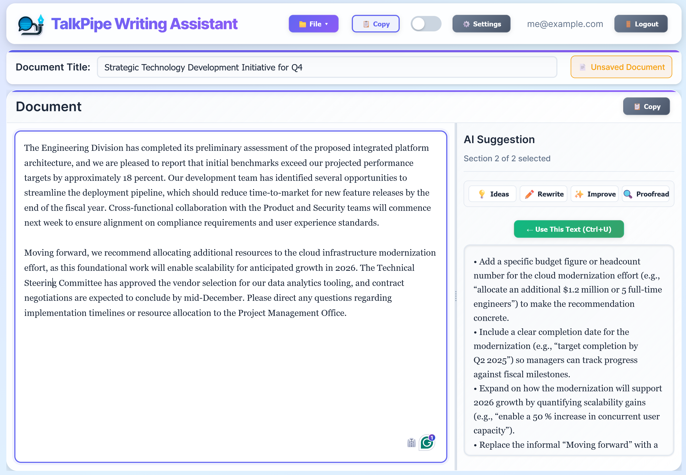

<center></center>

# TalkPipe Writing Assistant

Making the AI write _with_ you, not _for_ you.

An AI-powered writing assistant that transforms how you create structured documents. This application combines intelligent content generation with intuitive document management, enabling writers to craft professional documents with contextually-aware AI assistance that understands your style, audience, and objectives.

Built on the [TalkPipe framework](https://github.com/sandialabs/talkpipe), this tool helps you:

- **Break writer's block**: Generate initial drafts and ideas for any section
- **Maintain consistency**: AI understands your document's context, style, and tone across all sections
- **Iterate quickly**: Multiple generation modes (rewrite, improve, proofread, ideas) let you refine content efficiently
- **Stay organized**: Structure documents into sections with main points and supporting text
- **Use the LLM of your choice**: Works with LLM endpoints including OpenAI, Anthropic, and Ollama — cloud APIs, compatible gateways, or fully local, offline models

<center></center>

## Features

- **Multi-User Support**: JWT-based authentication with per-user document isolation
- **Structured Document Creation**: Organize your writing into sections with main points and user text
- **AI-Powered Generation**: Generate contextually-aware paragraph content using advanced language models
- **Multiple Generation Modes**:
  - **Rewrite**: Complete rewrite with new ideas and improved clarity
  - **Improve**: Polish existing text while maintaining structure
  - **Proofread**: Fix grammar and spelling errors only
  - **Ideas**: Get specific suggestions for enhancement
- **Real-time Editing**: Dynamic web interface for seamless writing and editing
- **Document Management**: Save, load, and manage multiple documents with automatic snapshots
- **User Preferences**: Per-user AI settings, writing style, and environment variables
- **Customizable Metadata**: Configure writing style, tone, audience, and generation parameters
- **Flexible AI Backend**: Works with LLM endpoints including OpenAI (GPT-4, GPT-4o), Anthropic (Claude 3.5 Sonnet, Claude 3 Opus), and Ollama (llama3, mistral, etc.)
- **Database Storage**: SQLite database with configurable location for easy backup and deployment
- **Async Processing**: Efficient queuing system for AI generation requests

## Pre-built container (Podman or Docker)

CI publishes a public image to [GitHub Container Registry](https://github.com/sandialabs/talkpipe-writing-assistant/pkgs/container/talkpipe-writing-assistant) (`ghcr.io/sandialabs/talkpipe-writing-assistant`; Linux amd64/arm64; no registry login needed). Run it with the database persisted under `/app/data`:

```bash
podman run --rm -p 8001:8001 \
  -v wa_data:/app/data \
  ghcr.io/sandialabs/talkpipe-writing-assistant:latest
```

Then open **http://localhost:8001** (use `http`, not `https`). `docker run` works with the same flags. `run` pulls the image automatically — no separate `pull` step is needed.

**Tags:** `latest` — stable release; `experimental` — pre-releases; branch names and commit SHAs are also published.

For Windows notes, connectivity troubleshooting, building from a local clone,
and production deployment, see the
[Container Deployment Guide](CONTAINER_DEPLOYMENT.md).

## Installation

### Prerequisites

- Python 3.11.4 or higher
- Access to an LLM endpoint: OpenAI, Anthropic, Ollama (local), or any compatible endpoint

> **Note:** On most modern systems (Debian/Ubuntu, Fedora, macOS with Homebrew),
> installing into the system Python is blocked or `pip` is not installed at all.
> Create a virtual environment first — the `pip` commands below assume one is
> active:
>
> ```bash
> python3 -m venv .venv
> source .venv/bin/activate   # Windows: .venv\Scripts\activate
> ```

### Install from pip (Recommended)

```bash
pip install talkpipe-writing-assistant
```

After installation, you can start the application immediately:

```bash
writing-assistant
```

Then navigate to `http://localhost:8001` in your browser. See the [Quick Start](#quick-start) section below for next steps.

### Install from source

```bash
git clone https://github.com/sandialabs/talkpipe-writing-assistant.git
cd talkpipe-writing-assistant
pip install -e .
```

### Development Installation

```bash
git clone https://github.com/sandialabs/talkpipe-writing-assistant.git
cd talkpipe-writing-assistant
pip install -e .[dev]
```

### Development environment (uv, with a reproducible lock)

The repo includes [`uv.lock`](uv.lock) so contributors share one resolved set of versions. Install [uv](https://github.com/astral-sh/uv), then:

```bash
git clone https://github.com/sandialabs/talkpipe-writing-assistant.git
cd talkpipe-writing-assistant
uv sync --extra dev
```

Run tests and tools via the project environment, for example `uv run pytest`, or activate the virtualenv (`.venv` on Unix: `source .venv/bin/activate`).

**Code quality.** CI fails on any finding from `ruff check .`, `ruff format --check .`, or `mypy` (rule set and type-checking config live in `pyproject.toml`), so run them before pushing — `ruff check --fix . && ruff format .` fixes most findings. To run the same checks on every commit, opt in once per clone with `uv run pre-commit install`; `pre-commit run --all-files` reproduces the CI gate locally.

**CI does not use the lockfile.** It installs with pip (`pip install -e '.[dev]'`) and resolves dependencies fresh, on purpose: that is what someone running `pip install talkpipe-writing-assistant` gets, so the build breaks when *they* would break. A dependency problem that only the lockfile hides is one we want CI to see — this project has been bitten by exactly that, when an unpinned FastAPI release broke it.

Two consequences worth remembering:

- `uv.lock` is a development convenience. It pins nothing for users and is not a security control — the version floors in `pyproject.toml` are what actually protect an install. Fix a vulnerable dependency by raising its floor, not by refreshing the lock.
- The lock must still stay honest. CI runs `uv lock --check`, which installs nothing and fails only when `uv.lock` and `pyproject.toml` have drifted apart. After changing dependencies in `pyproject.toml`, run `uv lock` and commit `uv.lock`. To bump versions, use `uv lock --upgrade` or `uv lock --upgrade-package <name>`.

### Using a container (Podman or Docker)

Build and run from the repository (as opposed to the [pre-built GHCR image](#pre-built-container-podman-or-docker) above):

```bash
# Optional: create a local configuration file first
cp .env.example .env

# Production deployment
podman-compose up writing-assistant

# Development with live reload
podman-compose --profile dev up writing-assistant-dev
```

`docker-compose` (or `docker compose`) works with the same arguments.

See the [Container Deployment Guide](CONTAINER_DEPLOYMENT.md) for the full
deployment guide (configuration, backups, user management, and production
hardening).

## Quick Start

**TL;DR:** After `pip install talkpipe-writing-assistant`, just run `writing-assistant` and open `http://localhost:8001` in your browser!

After installing with pip, follow these steps to get started:

### 1. Start the Server

```bash
writing-assistant
```

The server will start on `http://localhost:8001` and display:

```
🔐 Writing Assistant Server - Multi-User Edition
📝 Access your writing assistant at: http://localhost:8001/
🔑 Register a new account at: http://localhost:8001/register
🔐 Login at: http://localhost:8001/login
📚 API documentation: http://localhost:8001/docs
💾 Database: /home/user/.writing_assistant/writing_assistant.db
```

### 2. Create Your Account

1. Open your browser and navigate to `http://localhost:8001/register`
2. Enter your email address and password
3. Click "Create Account", then log in on the login page

### 3. Configure AI Backend

Point the application at an LLM endpoint — OpenAI, Anthropic, and Ollama are supported out of the box:

**Option A: OpenAI (Cloud)**
1. Get an API key from [OpenAI Platform](https://platform.openai.com/api-keys)
2. Set your API key:
   ```bash
   export OPENAI_API_KEY="sk-your-api-key-here"
   ```
3. In the web interface: Settings → AI Settings → Set Source to `openai` and Model to your model of choice.

**Option B: Anthropic (Cloud)**
1. Get an API key from [Anthropic Console](https://console.anthropic.com/)
2. Set your API key:
   ```bash
   export ANTHROPIC_API_KEY="sk-ant-your-api-key-here"
   ```
3. In the web interface: Settings → AI Settings → Set Source to `anthropic` and Model to your model of choice.

**Option C: Ollama (Local, Free)**
1. Install Ollama from [ollama.com](https://ollama.com)
2. Pull a model: `ollama pull [model name]`
3. Start Ollama: `ollama serve`
4. In the web interface: Settings → AI Settings → Set Source to `ollama` and Model to [model name]

If Ollama runs on a different machine (or a non-default port), set
`TALKPIPE_OLLAMA_SERVER_URL` before starting the server (if the server is
already running, stop it and start it again with the variable set):

```bash
export TALKPIPE_OLLAMA_SERVER_URL="http://your-ollama-host:11434"
writing-assistant
```

Alternatively, set it without restarting the server: in the web interface,
open Settings → AI Settings → Connection and enter the address in **Server
URL**. Values set this way are stored in your browser and applied per
generation request (unless the server was started with
`--disable-custom-env-vars`).

The Connection fields apply to whichever source is selected: **Server
URL** is an alternate API endpoint for `openai`/`anthropic` or the Ollama
server for `ollama`, and **API Key** supplies your key for the cloud
sources. Use the **Test Connection** button to verify the settings with a
real round trip before generating — it reports exactly what is wrong
(missing key, unreachable server, model not pulled) on failure.

> **Note:** AI Source is a dropdown offering `openai`, `anthropic`, and
> `ollama`, plus "Server default", which defers to the source configured on
> the server (TalkPipe configuration).

### 4. Start Writing!

1. After logging in, the editor opens directly — add a title and start typing.
   Leave a blank line between sections (paragraphs).
2. Place your cursor in a section, then click one of the generation buttons
   below the editor — **Ideas**, **Rewrite**, **Improve**, or **Proofread** —
   to create AI-assisted content for that section.
3. When you like a suggestion, click **"← Use This Text"** to replace the
   section with it.
4. Save your work via the **File ▾** menu (**File → Save**); the File menu also
   offers Save As, Open, snapshots, and import/export.

That's it! You're ready to use the AI writing assistant.

## Usage

### Starting the Server

```bash
# Default: http://localhost:8001
writing-assistant

# Custom port
writing-assistant --port 8080

# Custom host and port
writing-assistant --host 0.0.0.0 --port 8080

# Enable auto-reload for development
writing-assistant --reload

# Custom database location
writing-assistant --db-path /path/to/database.db

# Disable custom environment variables from UI (security)
writing-assistant --disable-custom-env-vars

# Initialize database without starting server
writing-assistant --init-db

# You can also use environment variables
WRITING_ASSISTANT_PORT=8080 writing-assistant
WRITING_ASSISTANT_RELOAD=true writing-assistant
WRITING_ASSISTANT_DB_PATH=/path/to/database.db writing-assistant
```

When the server starts, it will display:
- The URL to access the application
- Registration and login URLs
- API documentation URL
- Database location

**Authentication:** The application uses JWT-based multi-user authentication with FastAPI Users. Each user has their own account with secure password storage. New users can register through the web interface at `/register`, and existing users log in at `/login`.

### Environment Variables

Configure the application with these environment variables:

| Variable | Description | Default |
|----------|-------------|---------|
| `WRITING_ASSISTANT_HOST` | Server host address | `localhost` |
| `WRITING_ASSISTANT_PORT` | Server port number | `8001` |
| `WRITING_ASSISTANT_RELOAD` | Enable auto-reload (development) | `false` |
| `WRITING_ASSISTANT_DB_PATH` | Database file location | `~/.writing_assistant/writing_assistant.db` |
| `WRITING_ASSISTANT_SECRET` | JWT secret key for authentication | Auto-generated (change in production) |
| `TALKPIPE_OLLAMA_SERVER_URL` | Ollama server URL for local models | `http://localhost:11434` |
| `ALLOW_CUSTOM_ENV_VARS` | Allow users to configure environment variables through the UI (`false` to disable) | `true` |


**Security Options:**
- `--disable-custom-env-vars` (or `ALLOW_CUSTOM_ENV_VARS=false`): Prevents users from configuring environment variables through the browser interface
  - Use this for shared deployments or when you want centralized credential management
  - Environment variables must be set at the server level (via shell environment)
  - The Environment Variables section will be hidden in the UI


**Configure document metadata**:
   - AI Source: `openai`, `anthropic`, or `ollama`
   - Model: e.g., `gpt-4`, `claude-3-5-sonnet-20241022`, or `llama3.1:8b`
   - Writing style: formal, casual, technical, etc.
   - Target audience: general public, experts, students, etc.
   - Tone: neutral, persuasive, informative, etc.
   - Word limit: approximate words per paragraph

### Document Storage

Documents are stored in an SQLite database with multi-user isolation:

**Default Location:** `~/.writing_assistant/writing_assistant.db`

**Custom Location:** Use `--db-path` or `WRITING_ASSISTANT_DB_PATH` to specify an alternative location

**Features:**
- Per-user document isolation (users only see their own documents)
- Automatic snapshot management (keeps 10 most recent versions)
- User-specific preferences (AI settings, writing style, etc.)
- Cascade deletion (removing a user deletes all their documents)

**Backup:** Simply copy the database file to create a backup. The database can be moved to a different location using the `--db-path` option.

## Administration

Two console commands are installed alongside the application for user management:

```bash
# Create the first admin (superuser) account
writing-assistant-create-superuser

# Manage users (list, info, delete, reset-password, toggle-active, make-superuser)
writing-assistant-admin list
writing-assistant-admin help
```

See the [Admin Guide](ADMIN_GUIDE.md) for the full user-administration
reference and the [Container Deployment Guide](CONTAINER_DEPLOYMENT.md) for running these
commands inside a container.

## Architecture

### Package Structure

```
src/writing_assistant/
├── __init__.py          # Package initialization and version
├── core/                # Core business logic
│   ├── __init__.py
│   ├── callbacks.py     # AI text generation functionality
│   ├── definitions.py   # Data models (Metadata)
│   └── segments.py      # TalkPipe segment registration
└── app/                 # Web application
    ├── __init__.py
    ├── main.py          # FastAPI application and API endpoints
    ├── server.py        # Application entry point
    ├── static/          # CSS and JavaScript assets
    └── templates/       # Jinja2 HTML templates
```

### Core Components

- **Metadata**: Configuration for writing style, audience, tone, and AI settings
- **Section**: Individual document sections with async text generation and queuing
- **Document**: Complete document with sections, metadata, and snapshot management
- **Callbacks**: AI text generation using TalkPipe with context-aware prompting

### Customizing Generation

The prompt templates and the four generation modes (rewrite, improve,
proofread, ideas) live in `src/writing_assistant/core/callbacks.py`, built on
TalkPipe's `LLMPrompt` segment. To change how text is generated — adjust the
prompts or swap in a different TalkPipe pipeline — edit that module and
reinstall (`pip install -e .` from a checkout). To add a whole new mode you
also need to add its button to the web UI: the mode buttons are defined in
`src/writing_assistant/app/templates/index.html` (the `.mode-btn` elements)
and sent by `src/writing_assistant/app/static/script.js`. Any backend with
an OpenAI-, Anthropic-, or Ollama-compatible endpoint works; point the
provider API key / base URL settings (or `TALKPIPE_OLLAMA_SERVER_URL` for
Ollama) at your endpoint and select the source/model in Settings → AI
Settings.


## Troubleshooting

### Application Issues

**"Port already in use"**
- Change the port: `writing-assistant --port 8080`
- Or kill the process using the port

**"Cannot save document"** or **"Database error"**
- Check write permissions to the database directory (default: `~/.writing_assistant/`)
- Ensure the directory exists: `mkdir -p ~/.writing_assistant`
- Try a different database location: `writing-assistant --db-path /tmp/test.db`
- Initialize the database manually: `writing-assistant --init-db`

**"Authentication failed"** or **"Invalid credentials"**
- Double-check your email and password
- Register a new account if you haven't already
- The database may have been reset - check the database location

**"Cannot connect to database"**
- Verify the database file exists and is not corrupted
- Check file permissions on the database file
- Try initializing a new database: `writing-assistant --db-path /tmp/new.db --init-db`


## License

This project is licensed under the Apache License 2.0. See the [LICENSE](https://github.com/sandialabs/talkpipe-writing-assistant/blob/master/LICENSE) file for details.

## Acknowledgments

Built with [TalkPipe](https://github.com/sandialabs/talkpipe), a flexible framework for AI pipeline construction developed at Sandia National Laboratories.